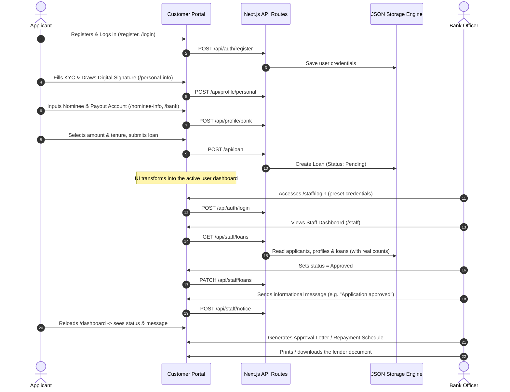
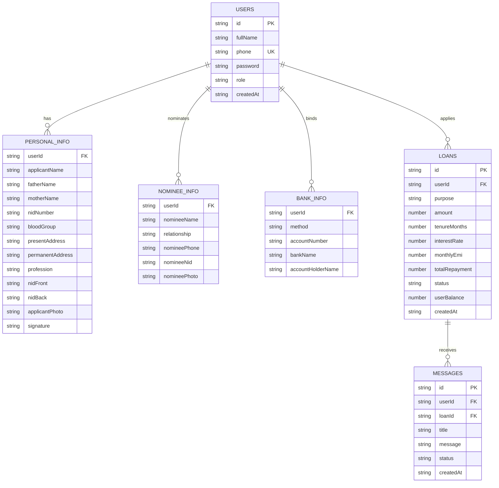

# Software Requirements Specification (SRS)
## Project: MyBank Bangladesh - Digital Loan Application & Staff Administration System
**Document Version:** 2.0.0  
**Date:** October 2026  
**Status:** Approved & Implemented  
**Standard Compliance:** IEEE Std 830-1998 (Recommended Practice for Software Requirements Specifications)

---

## Table of Contents
1. [Introduction](#1-introduction)
   - 1.1 Purpose
   - 1.2 Document Conventions
   - 1.3 Intended Audience
   - 1.4 Product Scope
   - 1.5 References
2. [Overall Description](#2-overall-description)
   - 2.1 Product Perspective
   - 2.2 System Features Summary
   - 2.3 User Classes and Personas
   - 2.4 Operating Environment & Technology Stack
   - 2.5 Design & Implementation Constraints
   - 2.6 Assumptions & Dependencies
3. [System Architecture & Data Models](#3-system-architecture--data-models)
   - 3.1 Architectural Topology
   - 3.2 System Sequence Diagram
   - 3.3 Entity-Relationship Data Model
4. [External Interface Requirements](#4-external-interface-requirements)
5. [System Features & Functional Requirements](#5-system-features--functional-requirements)
   - 5.1 Module 1: Authentication & Protected Access Control
   - 5.2 Module 2: Multi-Step KYC & Identity Capture
   - 5.3 Module 3: Digital Signature Capture Subsystem
   - 5.4 Module 4: Nominee Profile Subsystem
   - 5.5 Module 5: Payout & Bank Account Management
   - 5.6 Module 6: Loan Application & Live EMI Calculator
   - 5.7 Module 7: Dynamic User Dashboard State Engine
   - 5.8 Module 8: Staff & Admin Management Portal
   - 5.9 Module 9: Applicant Messaging (Informational)
   - 5.10 Module 10: Lender Document Generation Subsystem
   - 5.11 Module 11: Loan Lifecycle & Deletion Management
6. [Specification of the Generated Documents](#6-specification-of-the-generated-documents)
7. [Non-Functional Requirements](#7-non-functional-requirements)
8. [Verification & Acceptance Criteria](#8-verification--acceptance-criteria)
9. [Appendix: Environment Configuration & Credentials](#9-appendix-environment-configuration--credentials)

---

## 1. Introduction

### 1.1 Purpose
This document specifies the software requirements for the **MyBank Digital Loan Application & Management Portal**. It describes the functional workflows, behavioural characteristics, data architecture, security constraints, and interfaces for both the customer-facing applicant portal and the back-office staff administration dashboard.

MyBank is a demonstration/prototype lending platform. **"MyBank" is a fictional brand used for this project and does not represent any real bank, government body, or other institution.** The system lends money and tracks repayment; it does not collect any fee from an applicant as a condition of receiving a loan, and it does not generate documents on behalf of any third-party authority.

### 1.2 Document Conventions
- **MUST / SHALL**: Mandatory functional requirements that the system implements.
- **SHOULD**: Strongly recommended architectural practices.
- **MAY / CAN**: Permissible variations and extensions.
- Backtick styling (e.g., `/api/loan`, `db.json`) designates code entities, REST endpoints, and schema properties.

### 1.3 Intended Audience
- **Software Engineers & Full-Stack Developers:** development, code auditing, and feature enhancement.
- **QA Engineers & Testers:** construction of end-to-end verification suites.
- **Product Owners:** to confirm the customer journey and administrative workflow.
- **System Administrators:** local execution and deployment.

### 1.4 Product Scope
MyBank Bangladesh is a responsive, mobile-first loan application and customer management platform. It facilitates:
1. Digital loan applications ranging from ৳ 50,000 to ৳ 20,00,000.
2. Multi-step digital KYC capture: national identity document images (NID front/back), applicant photograph, and a drawn digital signature.
3. Nominee and payout-destination capture (bKash, Nagad, Rocket, or a commercial bank account).
4. A real-time, dynamic EMI calculator and live loan-status monitoring.
5. A role-based, password-protected staff dashboard with **real** telemetry computed from the database, search/filtering, applicant inspection, status updates (approve/pending/reject), balance updates, and application deletion.
6. Informational in-app messaging from staff to applicants (status updates, document requests, repayment reminders). Messages **never** request a payment or fee.
7. Generation of the lender's own documents only: a **Loan Approval Letter**, a **Repayment Schedule**, and a **Disbursement Advice**, all on MyBank branding.

Explicitly **out of scope** (and intentionally not implemented): any pre-disbursement or "unlock" fee flow; any account freeze/unfreeze fee; and generation of documents attributed to any external authority (police, courts, tax/treasury offices, other banks, or insurers).

### 1.5 References
- IEEE Std 830-1998 — Recommended Practice for Software Requirements Specifications.
- Next.js 14 App Router documentation.

---

## 2. Overall Description

### 2.1 Product Perspective
The system is a full-stack web application built with **Next.js 14**, **React 18**, and **Tailwind CSS**, backed by a file-based JSON store.

```
+------------------------------------------------------------------------+
|                         MyBank Web Ecosystem                           |
|                                                                        |
|  +---------------------------+       +------------------------------+  |
|  |     Customer Portal       |       |  Protected Admin Dashboard   |  |
|  | (Mobile-First Blue Theme) |       |   (Dark Navy Admin Theme)    |  |
|  +-------------+-------------+       +--------------+---------------+  |
|                |                                    |                  |
|                +------------------+-----------------+                  |
|                                   |                                    |
|                        [ Next.js API Routes ]                          |
|                  (Auth, Loan, Messages, Documents)                     |
|                                   |                                    |
|                        +----------v----------+                         |
|                        | Supabase PostgreSQL |                         |
|                        | Auth + Private Store|                         |
|                        +---------------------+                         |
+------------------------------------------------------------------------+
```

### 2.2 System Features Summary
| Feature Group | Key Capabilities |
| :--- | :--- |
| **Authentication** | Supabase Auth password login with verified phone identity, cookie sessions, and database-backed staff roles. |
| **KYC Capture** | Personal information, blood group, NID image attachments, applicant photo, digital signature pad. |
| **Nominee & Bank** | Nominee relationship binding, optional nominee attachments, payout method selection (bKash/Nagad/Rocket/Bank). |
| **Dynamic Dashboard** | Automatic transformation from application form to active loan dashboard after submission. |
| **Staff Telemetry** | Metric cards (Total / Approved / Pending / Rejected) computed **from real database counts**, with live search and sort. |
| **Loan Management** | Inline status switching (Approved/Pending/Rejected), balance editing, application deletion. |
| **Messaging** | Informational staff-to-applicant messages (status/document/reminder). No fees, ever. |
| **Document Generator** | Three lender-issued documents: Approval Letter, Repayment Schedule, Disbursement Advice, with a browser Print/PDF engine. |

### 2.3 User Classes and Personas
1. **Loan Applicant (Customer):** accesses the portal via smartphone browser; needs clear Bangla typography and transparent EMI figures.
2. **Credit Verification Officer (Staff):** accesses `/staff` on desktop/tablet; reviews KYC, updates status, and sends informational messages.
3. **Branch Manager / Administrator:** a separately provisioned staff account can approve/reject, adjust balances, generate lender documents, or delete invalid applications.

### 2.4 Operating Environment & Technology Stack
- **Runtime Engine:** Node.js v20.9+ LTS (Node 22 LTS recommended).
- **Core Framework:** Next.js 16.x (App Router and Proxy).
- **Frontend UI:** React 18, Tailwind CSS v3.4, Lucide React icons.
- **Typography:** Google Fonts (`Hind Siliguri` for Bengali, `Inter` for alphanumeric).
- **Data Store:** Supabase PostgreSQL with Row Level Security; private Supabase Storage for applicant documents.
- **Signature Subsystem:** HTML5 Canvas 2D with high-DPI scaling and touch/pointer handling.
- **Document Output:** CSS `@media print` with vector/DOM rendering.

> **Security note:** passwords are managed by Supabase Auth. Staff access and applicant data are checked on the server and constrained by database policies. HTTPS and review of applicable privacy and financial regulations are required for deployment.

### 2.5 Design & Implementation Constraints
- User and staff records are provisioned through Supabase Auth; staff membership is granted explicitly in `staff_members`.
- Identity images are uploaded to a private Storage bucket and served using short-lived signed URLs.

### 2.6 Assumptions & Dependencies
- A Supabase project with phone confirmation disabled and at least one explicitly provisioned staff account are required.
- The host has network access to Google Fonts (or a local fallback font is acceptable).

---

## 3. System Architecture & Data Models

### 3.1 Architectural Topology
- **Server Routes (`app/api/*`):** asynchronous REST endpoints handling validation, DB reads/writes, and status transitions.
- **Client Components (`'use client'`):** interactive canvas drawing, live EMI calculation, carousel, and modal dialogs.

### 3.2 System Sequence Diagram



### 3.3 Entity-Relationship Data Model



---

## 4. External Interface Requirements

### 4.1 User Interfaces (UI/UX)
- **Customer Portal:** Brand Blue (`#2563eb`), slate backgrounds, emerald confirmation accents, amber EMI highlight card.
- **Staff Portal:** Dark navy background with card elevation and cyan accents; credential pills (ID / Name / Phone / Password) for quick review.
- **Touch optimization:** large touch targets and device-pixel-ratio canvas scaling for signatures.

### 4.2 Software & Runtime Interfaces
- **Storage:** Node.js `fs` synchronous/asynchronous I/O with recursive directory creation and cold-start seeding of the admin account.
- **Image processing:** in-memory `FileReader` Base64 encoding.

---

## 5. System Features & Functional Requirements

### 5.1 Module 1: Authentication & Protected Access Control
- **FR-1.1:** The system SHALL validate phone numbers and prohibit duplicate registrations.
- **FR-1.2:** The system SHALL provide password reveal/conceal toggles on password fields.
- **FR-1.3:** Staff routes SHALL be isolated behind a credential challenge at `/staff/login`.
- **FR-1.4:** Unauthenticated visits to `/staff` SHALL redirect to `/staff/login`.
- **FR-1.5:** A single administrator account SHALL be preset at first run. Its credentials SHALL **not** be displayed or pre-filled on the login screen. Valid admin credentials SHALL grant access to `/staff` and persist a session in `localStorage.staff_session`.

### 5.2 Module 2: Multi-Step KYC & Identity Capture
- **FR-2.1:** `/personal-info` SHALL capture Applicant Full Name, Father's Name, Mother's Name, and NID Number.
- **FR-2.2:** Blood Group SHALL enforce standard options (`A+`, `A-`, `B+`, `B-`, `O+`, `O-`, `AB+`, `AB-`, and "জানা নেই").
- **FR-2.3:** The system SHALL provide preview and removal for NID Front, NID Back, and applicant photo. Missing images SHALL be stored as empty (never substituted with sample images).

### 5.3 Module 3: Digital Signature Capture Subsystem
- **FR-3.1:** The HTML5 Canvas SHALL support continuous strokes for both pointer (mouse) and touch events.
- **FR-3.2:** The system SHALL provide a "স্বাক্ষর মুছুন" (Clear Signature) control.
- **FR-3.3:** The drawn signature SHALL serialize to a PNG Base64 Data URL and be shown in staff review and in generated documents where applicable.

### 5.4 Module 4: Nominee Profile Subsystem
- **FR-4.1:** `/nominee-info` SHALL capture Nominee Name, Relationship, Phone, and NID.
- **FR-4.2:** Optional nominee photo and NID attachments SHALL be supported.

### 5.5 Module 5: Payout & Bank Account Management
- **FR-5.1:** `/bank` SHALL support payout provider selection: `bkash`, `nagad`, `rocket`, and `bank`.
- **FR-5.2:** Saved payout accounts SHALL render in the saved-account card.

### 5.6 Module 6: Loan Application & Live EMI Calculator
- **FR-6.1:** The system SHALL offer pre-configured loan amounts from ৳ 50,000 up to ৳ 20,00,000.
- **FR-6.2:** The system SHALL support tenures of 12, 24, 36, 48, and 60 months.
- **FR-6.3:** Interest is a flat annual rate of **2.4%**. The computation is:
  $$\text{Total Repayment} = \text{Principal} + \left(\text{Principal} \times \frac{\text{Tenure}}{12} \times 0.024\right)$$
  $$\text{Monthly EMI} = \frac{\text{Total Repayment}}{\text{Tenure}}$$
  The server (`/api/loan`) and the client preview SHALL use the same formula so displayed and stored values agree.
- **FR-6.4:** The live EMI card SHALL update on every change of amount or tenure without a page refresh.

### 5.7 Module 7: Dynamic User Dashboard State Engine
- **FR-7.1:** Before submission, `/dashboard` SHALL display the loan application form.
- **FR-7.2:** On submission, the interface SHALL transition into the active user dashboard.
- **FR-7.3:** The active dashboard SHALL display Current Loan, Available Balance, and Monthly EMI.
- **FR-7.4:** A withdrawal/disbursement action SHALL be enabled only when the loan status is `approved`; it represents disbursement to the applicant's own registered account and requires no payment from the applicant.
- **FR-7.5:** The applicant SHALL be able to open the form again to apply for another loan.
- **FR-7.6:** Any staff messages SHALL be shown as informational cards (title + message) with no payment control.

### 5.8 Module 8: Staff & Admin Management Portal
- **FR-8.1:** Top metrics SHALL display Total, Approved, Pending, and Rejected counts computed from the database (no fabricated baseline).
- **FR-8.2:** The search toolbar SHALL filter across name, phone, amount, and purpose; results SHALL be sortable by newest, amount, or name.
- **FR-8.3:** Selecting a row SHALL open the Applicant Details modal exposing:
  - Login credential pills (ID, Name, Phone, editable Password).
  - Loan details with editable status and editable balance.
  - Personal, nominee, and bank information (empty fields shown as "—", never fabricated).
  - An attachment gallery with click-to-enlarge; a "no file uploaded" placeholder is shown when an attachment is absent.

### 5.9 Module 9: Applicant Messaging (Informational)
- **FR-9.1:** Staff SHALL be able to compose a message to an applicant consisting of a **title** and a **message body**, optionally seeded from templates (application update, approved, document request, repayment reminder).
- **FR-9.2:** Messages SHALL be strictly informational. The system SHALL NOT provide any field to request a payment, fee, or deposit, and SHALL NOT render a "pay" control on the customer dashboard.
- **FR-9.3:** Staff SHALL be able to review and delete previously sent messages.

### 5.10 Module 10: Lender Document Generation Subsystem
- **FR-10.1:** Staff SHALL launch the Document Generator from the applicant modal with pre-populated applicant data.
- **FR-10.2:** The generator SHALL support exactly three documents, all issued by the lender on MyBank branding: **Loan Approval Letter**, **Repayment Schedule**, and **Disbursement Advice**.
- **FR-10.3:** The generator SHALL NOT produce any document attributed to an external authority (police, courts, tax/treasury offices, other banks, or insurers), and SHALL NOT contain any advance-fee, deposit, or "unlock" language.
- **FR-10.4:** The generator SHALL provide editable fields (officer name, dates, amounts) and a browser Print/PDF command using `@media print` rules.

### 5.11 Module 11: Loan Lifecycle & Deletion Management
- **FR-11.1:** A delete control SHALL be available per row and inside the applicant modal.
- **FR-11.2:** The system SHALL confirm before deletion.
- **FR-11.3:** Deletion SHALL execute `DELETE /api/staff/loans?id={loanId}`, removing the loan and its associated messages and updating the real metric counts.

---

## 6. Specification of the Generated Documents

All documents are the lender's own, on MyBank branding. No document is attributed to any third-party authority.

| No | Document Name | Purpose | Dynamic Fields |
| :--- | :--- | :--- | :--- |
| **1** | **Loan Approval Letter** | Confirms the credit committee's approval and the agreed terms. | Applicant name, father/mother, NID, address, approved amount, tenure, EMI, total repayable, officer, date. Explicitly states no advance payment is required. |
| **2** | **Repayment Schedule** | Month-by-month installment plan. | Applicant, amount, tenure, first-installment date, per-month due date / installment / running balance, total repayable. |
| **3** | **Disbursement Advice** | Confirms the approved amount is scheduled for disbursement to the applicant's own account. | Beneficiary name, account/method, disbursed amount, officer, date. States no fee is required to receive funds. |

---

## 7. Non-Functional Requirements

### 7.1 Performance
- Initial page load SHOULD be under ~1.5 s on a typical 4G connection.
- EMI calculation is synchronous in-browser.

### 7.2 Security & Access Controls
- Protected APIs SHALL derive identity from a verified Supabase Auth session, never from a client-supplied user ID.
- Database tables and private document storage SHALL enforce Row Level Security policies.
- Passwords SHALL be managed by Supabase Auth and transport SHALL use HTTPS.
- Staff privileges SHALL be granted through the server-managed `staff_members` table, never browser-supplied metadata.

### 7.3 Reliability & Data Availability
- Customer data SHALL persist in Supabase PostgreSQL and private Supabase Storage across application deploys.
- Production deployments SHALL configure backups and recovery for their Supabase project.

### 7.4 Usability & Localization
- Bilingual interface: Bengali typography for the customer journey alongside English technical labels.
- Single-column, thumb-friendly mobile layout.

---

## 8. Verification & Acceptance Criteria

| ID | Test Scenario | Expected Outcome | Status |
| :--- | :--- | :--- | :--- |
| **TC-01** | User registers with a new phone | Account is created without an SMS code and redirects to `/personal-info`. | PASS |
| **TC-02** | Register with a duplicate phone | Error: "এই ফোন নম্বরটি ইতিমধ্যে নিবন্ধিত আছে।" | PASS |
| **TC-03** | User draws signature and submits | Canvas exports Base64 PNG; persisted. | PASS |
| **TC-04** | User submits a loan application | Form transitions into the active dashboard with three metric cards. | PASS |
| **TC-05** | Unauthorized visit to `/staff` | Redirect to `/staff/login`. | PASS |
| **TC-06** | Non-staff user calls staff API | Request is rejected. | PASS |
| **TC-06b** | Customer changes submitted user ID | API continues to access only the authenticated customer's records. | PASS |
| **TC-07** | EMI check (৳50,000 / 12 mo) | Total = ৳51,200; EMI = ৳4,266.67. | PASS |
| **TC-08** | Staff metric cards | Counts equal the real number of records (no fabricated baseline). | PASS |
| **TC-09** | Staff sends a message | Applicant dashboard shows an informational message with no pay control. | PASS |
| **TC-10** | Admin deletes an application | Loan and its messages removed; metrics update. | PASS |
| **TC-11** | Document generator | Only Approval Letter, Repayment Schedule, and Disbursement Advice are offered. | PASS |

---

## 9. Appendix: Environment Configuration & Credentials

### Run Commands
```bash
cd H:\loan
npm install      # first time only
npm run dev
```

### Access URLs
- **Customer Portal / Login:** `http://localhost:3000/login`
- **Customer Registration:** `http://localhost:3000/register`
- **Protected Staff Login:** `http://localhost:3000/staff/login`
- **Staff Dashboard:** `http://localhost:3000/staff`

### Supabase Configuration
Copy `.env.example` to `.env.local`, fill in the Supabase URL and publishable key, apply the SQL migration, disable phone confirmation, and provision staff as described in [`supabase/SETUP.md`](supabase/SETUP.md). There is no default admin account or password.
